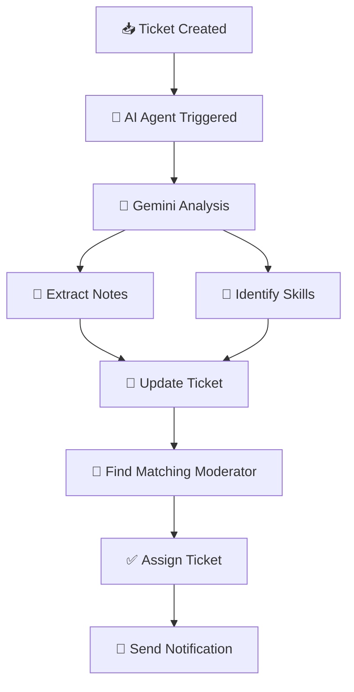

# 🎫 TickMate (AI Powered Ticketing System)

> An intelligent ticket management system that leverages AI to automatically analyze tickets, extract helpful notes, and assign them to the most qualified moderators based on skill matching.

## 🌟 Features

- **🔐 Secure Authentication**: JWT-based authentication with Argon2 password hashing
- **🎯 AI-Powered Ticket Analysis**: Gemini AI analyzes tickets and extracts relevant skills
- **👥 Smart Assignment**: Automatic ticket assignment to moderators with matching skills
- **📧 Email Notifications**: Resend integration for email communications
- **⚡ Background Processing**: Inngest for reliable background task execution
- **📊 Admin Dashboard**: Comprehensive admin panel for user and ticket management

## 🏗️ Architecture

### Tech Stack

| Component | Technology | Purpose |
|-----------|------------|---------|
| **Backend** | Node.js | Server runtime |
| **Database** | MongoDB + Mongoose | Data storage and ODM |
| **Authentication** | JWT + Argon2 | Secure user authentication |
| **AI Processing** | Gemini AI | Ticket analysis and skill extraction |
| **Background Jobs** | Inngest | Asynchronous task processing |
| **Email Service** | Resend | Email notifications |
| **Agent Framework** | Inngest AI Agent Kit | AI workflow orchestration |

### 🔄 System Flow

```
1. 👤 User Registration/Login
   ↓
2. 🎫 Ticket Creation
   ↓
3. 🤖 AI Agent Analysis (Gemini)
   ├── Extract helpful notes
   └── Identify required skills
   ↓
4. 🎯 Smart Assignment
   └── Match with moderator skills
   ↓
5. 📧 Notification System
   └── Email alerts via Resend
```

## 🚀 Quick Start

### Prerequisites

- Node.js (v16 or higher)
- MongoDB
- Resend API key
- Google Gemini API key
- Inngest account

### Installation

```bash
# Clone the repository
git clone https://github.com/talhabilal-dev/tickmate.git
cd tickmate

# Install dependencies
npm install

# Set up environment variables
cp .env.example .env
```

### Environment Variables

```env
# Database
MONGO_URI=mongodb+srv://<username>::<password>@cluster0.m8oca.mongodb.net/<database_name>?retryWrites=true&w=majority&appName=Cluster0

# JWT
JWT_SECRET=your-super-secret-jwt-key

# Gemini AI
GEMINI_API_KEY=your-gemini-api-key

# Resend Email
RESEND_API_KEY=your-resend-api-key

# Email
EMAIL_FROM=your-email

# Inngest
INNGEST_EVENT_KEY=your-inngest-event-key
INNGEST_SIGNING_KEY=your-inngest-signing-key

# Server
PORT=5000
NODE_ENV=development

# Client
APP_URL=http://localhost:5000
```

### Running the Application

```bash
# Start development server
npm run dev

# Start production server
npm start
```

## 📡 API Endpoints

### 🔐 Authentication Routes (`/api/auth`)

| Method | Endpoint | Description | Auth Required |
|--------|----------|-------------|---------------|
| `POST` | `/register` | User registration | ❌ |
| `POST` | `/login` | User login | ❌ |
| `POST` | `/logout` | User logout | ✅ |
| `PUT` | `/update-skills` | Update user skills | ✅ |
| `PUT` | `/update` | Update user profile | ✅ |
| `PUT` | `/update-password` | Change password | ✅ |
| `GET` | `/user` | Get user profile | ✅ |

### 🎫 Ticket Routes (`/api/tickets`)

| Method | Endpoint | Description | Auth Required |
|--------|----------|-------------|---------------|
| `GET` | `/` | Get all tickets | ✅ |
| `POST` | `/` | Create new ticket | ✅ |
| `PUT` | `/status/:id` | Toggle ticket status | ✅ |
| `GET` | `/get-assigned` | Get assigned tickets | ✅ |
| `PUT` | `/ticket-reply` | Reply to ticket | ✅ |
| `GET` | `/tickets-summary` | Get user ticket summary | ✅ |
| `DELETE` | `/delete-ticket` | Delete ticket | ✅ |
| `PUT` | `/edit-ticket` | Edit ticket | ✅ |

### 👑 Admin Routes (`/api/admin`)

| Method | Endpoint | Description | Auth Required |
|--------|----------|-------------|---------------|
| `GET` | `/users` | Get all users | ✅ |
| `GET` | `/tickets` | Get all tickets | ✅ |
| `GET` | `/dashboard` | Get admin dashboard | ✅ |
| `PUT` | `/update-user` | Update user | ✅ |
| `DELETE` | `/delete-user` | Delete user | ✅ |

## 🤖 AI Agent Workflow

### Ticket Processing Pipeline



### AI Analysis Features

- **📊 Content Analysis**: Extracts key information from ticket descriptions
- **🏷️ Skill Tagging**: Identifies required technical skills
- **📈 Priority Assessment**: Evaluates ticket urgency and complexity
- **💡 Solution Suggestions**: Provides initial troubleshooting steps

## 🔧 Configuration

- **🚀 Environment Variables**: Set up environment variables for configuration
- **📊 MongoDB**: Configure MongoDB connection details

## 🔒 Security Features

- **🛡️ Password Security**: Argon2 hashing algorithm
- **🔑 JWT Authentication**: Secure token-based authentication
- **🚫 Rate Limiting**: API endpoint protection
- **✅ Input Validation**: Comprehensive request validation
- **🔐 CORS Configuration**: Cross-origin request security

## 📚 Background Jobs

### Inngest Functions

- **🎫 Ticket Analysis**: Process new tickets with AI
- **📧 Email Notifications**: Send automated emails
- **📊 Analytics Processing**: Generate usage statistics
- **🧹 Cleanup Tasks**: Periodic data maintenance

### Production Checklist

- [ ] Environment variables configured
- [ ] MongoDB connection established
- [ ] Gemini API key valid
- [ ] Resend API configured
- [ ] Inngest webhooks set up
- [ ] SSL certificates installed
- [ ] Monitoring configured

## 📊 Monitoring & Analytics

- **📈 Ticket Metrics**: Response times, resolution rates
- **👥 User Analytics**: Active users, skill distribution
- **🤖 AI Performance**: Analysis accuracy, processing time
- **📧 Email Delivery**: Success rates, bounce tracking

## 🤝 Contributing

1. Fork the repository
2. Create a feature branch
3. Commit your changes
4. Push to the branch
5. Create a Pull Request

## 📄 License

This project is licensed under the MIT License - see the [LICENSE](LICENSE) file for details.

## 🆘 Support

For support and questions:

- 📧 Email: <contact@talhabilal.dev>
- 📖 Portfolio: [portfolio](https://talhabilal.dev)
- 🐛 Issues: [GitHub Issues](https://github.com/your-repo/issues)

---

<div align="center">

**Built with ❤️ using Node.js, MongoDB, and AI**

[🚀 Get Started](#quick-start) • [📡 API Docs](#api-endpoints) • [🤖 AI Features](#ai-agent-workflow)

</div>
